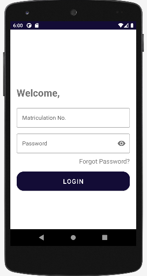
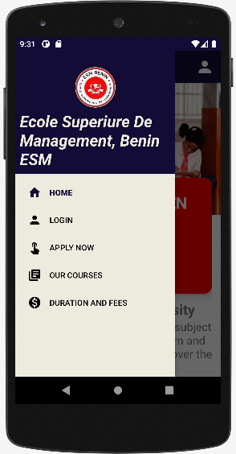

# School Mobile App
This is an App that integrates a lot of properties to help students in learning.
Each student will have a unique matriculation number and a password that they can use
to login and they can change the password anytime. This is a personal project.

## Features

* MVVM Architecture
* Firebase Authentication
* Firebase Datebase and Storage

## Libraries

* RecyclerView
* Navigation Component
* ViewModel
* Room
* Coroutines
* Material Design Components
* Firebase Auth
* Image Slider
* Country Code

## Prerequisite

To build this project, you will require:
* Android Studio

## ScreenShots

## Author
Leonard Etila Anibe
